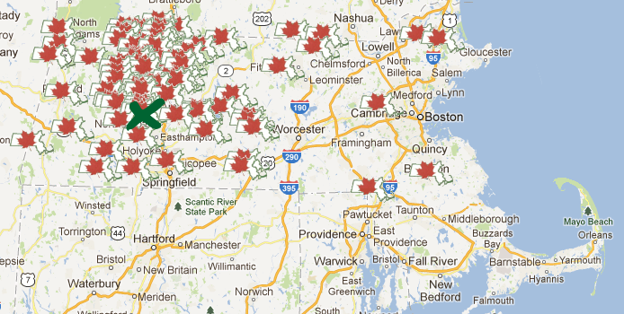

Maple syrup time is a high point in the cycle of all things Western Massachusetts, right up there with fair season.

Forget Puxatawny Phil. The appearance of buckets on trees and steam billowing from shacks is a sure sign of the impending spring. Breakfasting at a sugar house is an acknowledgement that the snow on ground won’t be there much longer, that the daffodils will poke out soon, that [Hadley Grass](http://www.saveur.com/article/Kitchen/Hadley-Grass-) is coming in a few months.

* Chester, MA Maple Fest
* Davenport Farm and Sugar House
* Gould's
* Red Bucket Sugar Shack
* Steve's Sugar Shack
* South Face Farm

March is the beginning of a new season, and a time to disobey your acupuncturist, nutritional counselor, and yoga instructor by ingesting sugar, carbs, and gluten. My personal motto: if it comes from a tree, it’s for me.

